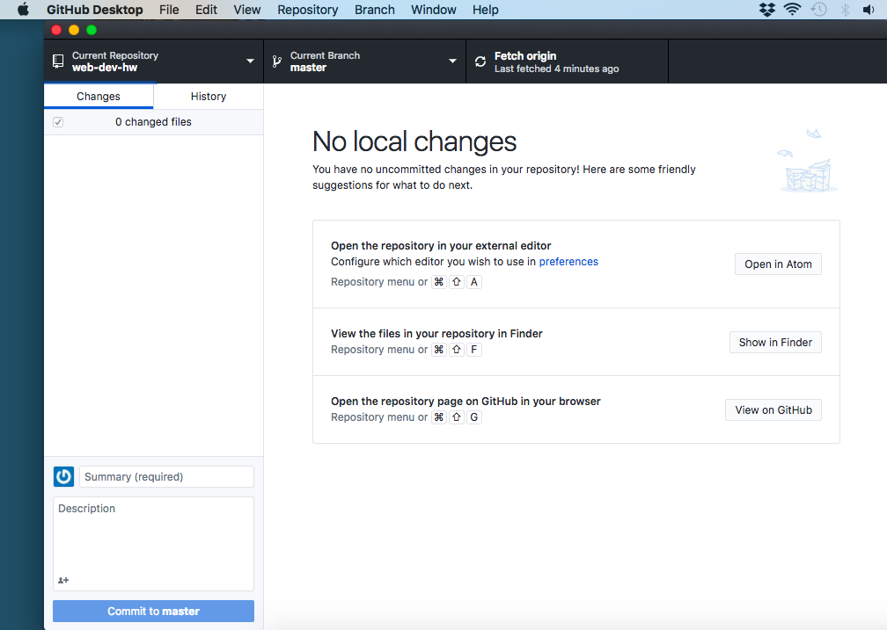
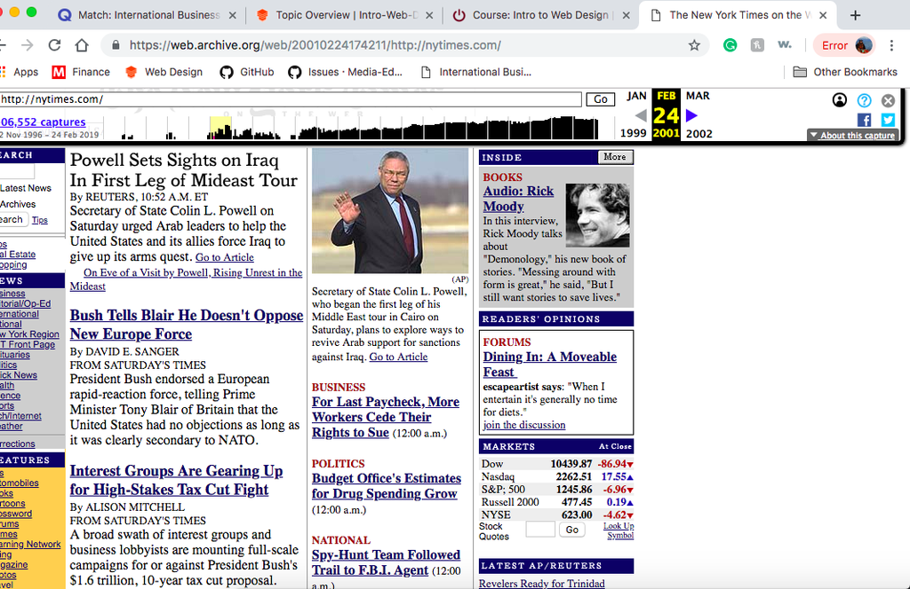

1. For my WayBack Machine, I went to New York Times page on 2/24/01. I thought this would be interesting because the news is ever changing. The article talks about then President Bush and the war with Iraq. The layout of the article reflected one of a newspaper. It was pretty basic with no moving images and looked pretty user friendly. The current NY Times has a wider page set up and doesn't mimic a newspaper as much. It is set up with strictly black text oppose to the blues and reds the 2/24/01 article was playing with.

2. The GIT Module was confusing at first with needing to "push" information but after some time it felt like second nature. It was hard to remember to use the desktop application instead of the website but I'm sure that will also come with time.

3.
